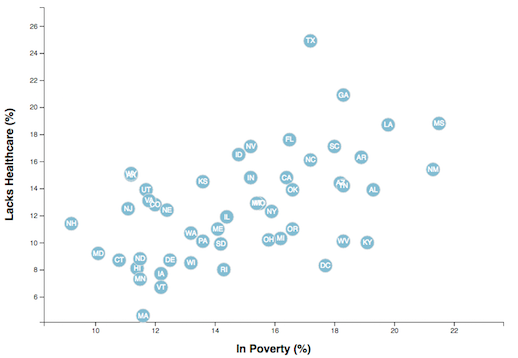

# D3-trends-visualization. Basic Folder
Shows a scatter plot between two data variables analyzing the current trends shaping people's lives such as Healthcare vs. Poverty or Smokers vs. Age.

Using D3 techniques, creates a scatter plot that represents each state with circle elements. The scatter appears like the image shown here.

* Include state abbreviations in the circles.

* Create and situate your axes and labels to the left and bottom of the chart.

# D3-trends-visualization. Adv Folder

Following the same idea from the basic folder. 
I created an interactive chart with animations. The results of this part will look similar to next gif image.

